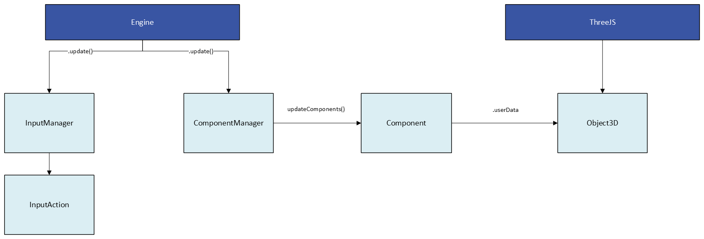

# ThreeJS Game Engine

Simple game engine built in ThreeJS. Currently implementing the following features:

**[Demo](https://tanner-c.github.io/web-game/)**

* Input Handling
* Entity Management
* Rendering
* Physics Simulation

This project demonstrates the following competencies:

- Building systems with ThreeJS
- Structuring a game engine
- Complex input handling

Notes
- Physics is listed in planned features but not yet implemented in code.
